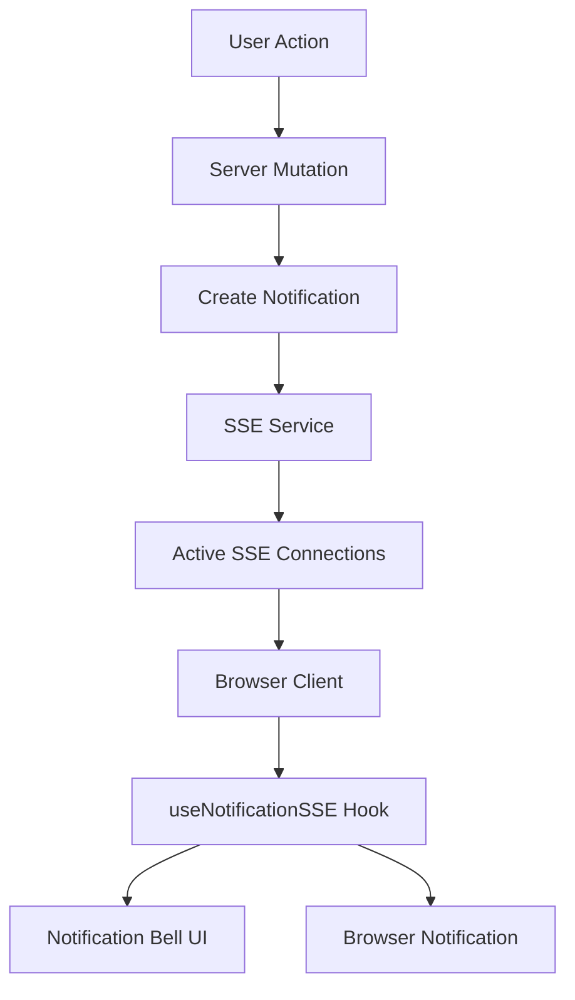

# Notifications System Documentation

## Overview

The Bandsy notifications system provides real-time notifications to users for various events like likes, super likes, matches, messages, and system updates. It uses Server-Sent Events (SSE) for real-time communication and supports both browser notifications and in-app notification display.

## Features

- ✅ **Real-time notifications** via Server-Sent Events (SSE)
- ✅ **Browser notifications** with native OS integration
- ✅ **Flexible notification types** - easily extensible for new events
- ✅ **Cross-browser support** (Chrome, Safari, Firefox)
- ✅ **Automatic reconnection** with exponential backoff
- ✅ **Connection persistence** across development reloads
- ✅ **Type-safe** implementation with TypeScript
- ✅ **Template system** for consistent notification formatting

## Architecture

### Components Overview



### Core Components

1. **Database Layer** (`src/server/db/schema.ts`)
   - `notifications` table for persistent storage
   - Flexible `data` JSON field for different notification types

2. **Server Functions** (`src/server/notifications/mutations.ts`)
   - `createNotification()` - Create and send notifications
   - `getUserNotifications()` - Fetch user notifications
   - `markNotificationsAsRead()` - Update read status

3. **SSE Service** (`src/lib/notifications/sse-service.ts`)
   - Manages active WebSocket-like connections
   - Handles connection lifecycle and cleanup
   - Broadcasts notifications to connected users

4. **API Routes**
   - `/api/notifications/stream` - SSE endpoint
   - `/api/notifications` - REST API for notifications

5. **Frontend Components**
   - `useNotificationSSE` hook - Real-time connection management
   - `NotificationBell` - UI component with badge
   - `NotificationsList` - Display notifications

## Notification Types

### Currently Supported

- `like_received` - When someone likes your profile
- `super_like_received` - When someone super likes your profile

### Adding New Notification Types

1. **Add to enum** in `src/server/db/schema.ts`:

```typescript
export const notificationTypeEnum = pgEnum("notification_type", [
  // ... existing types
  "new_notification_type",
]);
```

2. **Add type definition** in `src/types/notifications.ts`:

```typescript
export interface NotificationData {
  // ... existing types
  new_notification_type?: {
    customField: string;
    anotherField: number;
  };
}
```

3. **Add template** in `src/lib/notifications/templates.ts`:

```typescript
case 'new_notification_type':
  const newData = data as NotificationData['new_notification_type'];
  return {
    title: 'New Event!',
    message: `Something happened: ${newData?.customField}`,
    actionUrl: `/path/${newData?.customField}`,
    actionType: 'navigate',
  };
```

## Database Schema

### notifications Table

```sql
CREATE TABLE bandsy_notification (
    id UUID PRIMARY KEY DEFAULT gen_random_uuid(),
    user_id UUID NOT NULL REFERENCES bandsy_user(id) ON DELETE CASCADE,
    type notification_type NOT NULL,
    title VARCHAR(255) NOT NULL,
    message TEXT NOT NULL,
    data JSONB, -- Flexible data for different notification types
    action_url VARCHAR(500), -- Where to navigate when clicked
    action_type VARCHAR(50), -- 'navigate', 'modal', 'external'
    is_read BOOLEAN DEFAULT FALSE,
    is_archived BOOLEAN DEFAULT FALSE,
    scheduled_for TIMESTAMP WITH TIME ZONE, -- For future notifications
    expires_at TIMESTAMP WITH TIME ZONE, -- Auto-cleanup
    created_at TIMESTAMP WITH TIME ZONE DEFAULT CURRENT_TIMESTAMP,
    read_at TIMESTAMP WITH TIME ZONE
);

-- Indexes for performance
CREATE INDEX notifications_user_idx ON bandsy_notification(user_id);
CREATE INDEX notifications_unread_idx ON bandsy_notification(user_id, is_read);
CREATE INDEX notifications_type_idx ON bandsy_notification(type);
```

## API Reference

### REST Endpoints

#### GET /api/notifications

Fetch user notifications with pagination.

**Query Parameters:**

- `limit` (number, default: 20) - Number of notifications to fetch
- `offset` (number, default: 0) - Pagination offset
- `unreadOnly` (boolean, default: false) - Only fetch unread notifications

**Response:**

```typescript
{
  notifications: Notification[],
  unreadCount: number,
  pagination: {
    limit: number,
    offset: number,
    hasMore: boolean
  }
}
```

#### PATCH /api/notifications

Mark notifications as read.

**Body:**

```typescript
{
  action: 'mark_read',
  notificationIds?: string[] // Optional: specific notifications
}
```

#### GET /api/notifications/stream

Server-Sent Events endpoint for real-time notifications.

**Headers:**

- `Content-Type: text/event-stream`
- `Cache-Control: no-cache`
- `Connection: keep-alive`

**Event Types:**

- `connected` - Connection established
- `heartbeat` - Keep-alive ping (every 30s)
- `notification` - New notification received
- `unread_count` - Updated unread count

### Server Functions

#### createNotification()

```typescript
await createNotification({
  userId: "user-uuid",
  type: "like_received",
  data: {
    fromUserId: "sender-uuid",
    fromUserName: "John Doe",
    fromUserImage: "https://...",
  },
  expiresAt: new Date(Date.now() + 30 * 24 * 60 * 60 * 1000), // 30 days
});
```

#### getUserNotifications()

```typescript
const notifications = await getUserNotifications(userId, {
  limit: 10,
  unreadOnly: true,
});
```

#### markNotificationsAsRead()

```typescript
await markNotificationsAsRead(userId, [
  "notification-id-1",
  "notification-id-2",
]);
```

## Frontend Usage

### Using the SSE Hook

```typescript
import { useNotificationSSE } from '@/lib/hooks/useNotificationSSE';

function MyComponent() {
  const {
    unreadCount,
    notifications,
    isConnected,
    error
  } = useNotificationSSE();

  return (
    <div>
      <p>Unread: {unreadCount}</p>
      <p>Connected: {isConnected ? 'Yes' : 'No'}</p>
      {notifications.map(notif => (
        <div key={notif.id}>{notif.title}</div>
      ))}
    </div>
  );
}
```

### Notification Bell Component

```typescript
import { NotificationBell } from '@/components/notifications/notification-bell';

function TopNav() {
  return (
    <nav>
      {/* Other nav items */}
      <NotificationBell />
    </nav>
  );
}
```

## Integration Examples

### Creating Notifications from Mutations

```typescript
// When someone likes a user
export async function recordUserInteraction(
  fromUserId: string,
  toUserId: string,
  action: "like" | "super_like",
) {
  // ... record interaction in database

  // Create notification
  if (action === "like" || action === "super_like") {
    await createLikeNotification(fromUserId, toUserId, action);
  }
}

// Helper function
async function createLikeNotification(
  fromUserId: string,
  toUserId: string,
  interactionType: "like" | "super_like",
) {
  const fromUser = await getUserById(fromUserId);

  await createNotification({
    userId: toUserId,
    type:
      interactionType === "super_like"
        ? "super_like_received"
        : "like_received",
    data: {
      fromUserId,
      fromUserName: fromUser.displayName,
      fromUserImage: fromUser.profileImageUrl,
    },
    expiresAt: new Date(Date.now() + 30 * 24 * 60 * 60 * 1000), // 30 days
  });
}
```

### Match Creation Notification

```typescript
// When a match is created
export async function createMatch(user1Id: string, user2Id: string) {
  const match = await db
    .insert(matches)
    .values({
      user1Id,
      user2Id,
      status: "active",
    })
    .returning();

  const [user1, user2] = await Promise.all([
    getUserById(user1Id),
    getUserById(user2Id),
  ]);

  // Notify both users
  await Promise.all([
    createNotification({
      userId: user1Id,
      type: "match_created",
      data: {
        matchId: match[0].id,
        otherUserId: user2Id,
        otherUserName: user2.displayName,
        otherUserImage: user2.profileImageUrl,
      },
    }),
    createNotification({
      userId: user2Id,
      type: "match_created",
      data: {
        matchId: match[0].id,
        otherUserId: user1Id,
        otherUserName: user1.displayName,
        otherUserImage: user1.profileImageUrl,
      },
    }),
  ]);
}
```

## Performance Considerations

### Connection Management

- Connections are stored in memory and cleaned up automatically
- Uses `globalThis` to persist connections across Next.js dev reloads
- Heartbeat every 30 seconds to maintain connection health

### Database Optimization

- Indexes on frequently queried fields (`user_id`, `is_read`, `type`)
- Automatic cleanup of old notifications via `expires_at`
- Pagination to handle large notification lists

### Scaling Considerations

- Current implementation stores connections in memory (single server)
- For multi-server deployments, consider Redis for connection management
- Database partitioning for high-volume notifications

## Browser Compatibility

| Browser | Support | Notes                                   |
| ------- | ------- | --------------------------------------- |
| Chrome  | ✅ Full | Requires macOS notification permissions |
| Safari  | ✅ Full | Requires user gesture for permission    |
| Firefox | ✅ Full | Standard implementation                 |
| Edge    | ✅ Full | Chromium-based, same as Chrome          |

## Security Considerations

### Authentication

- All SSE connections require valid Clerk authentication
- User can only receive their own notifications
- API endpoints validate user ownership

### Data Privacy

- Notifications contain minimal sensitive data
- Full details fetched on-demand via action URLs
- Automatic cleanup prevents data accumulation

### Rate Limiting

- Consider implementing rate limits for notification creation
- Prevent spam from malicious users
- Batch similar notifications to reduce noise

## Monitoring and Logging

### Connection Metrics

```typescript
// Check active connections
console.log("Active connections:", NotificationSSEService.getConnectionCount());
console.log("User connections:", NotificationSSEService.getAllConnections());
```

### Error Tracking

- Connection failures logged with user context
- Failed message delivery tracked and cleaned up
- Client-side connection status monitoring

### Performance Metrics

- Track notification delivery success rates
- Monitor connection duration and stability
- Measure notification engagement (click rates)
