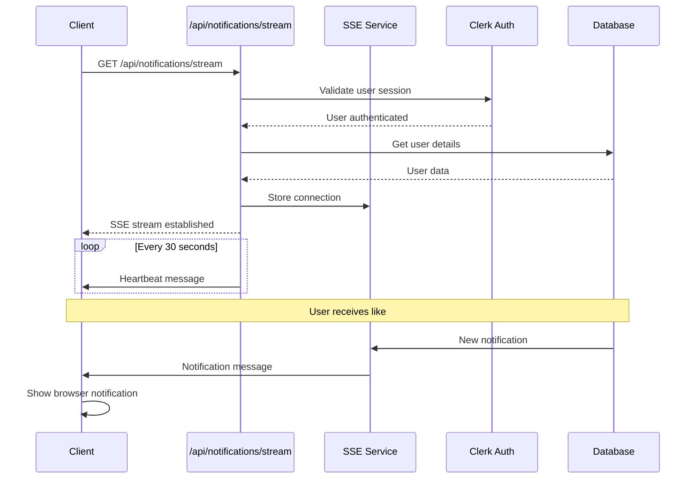

# Server-Sent Events (SSE) Implementation Guide

## Overview

This document provides technical details about the Server-Sent Events (SSE) implementation in the Bandsy notifications system. SSE was chosen over WebSockets for its simplicity, automatic reconnection, and better compatibility with HTTP infrastructure.

## Why SSE Over WebSockets?

| Feature               | SSE                        | WebSockets                    |
| --------------------- | -------------------------- | ----------------------------- |
| **Complexity**        | Simple HTTP-based          | More complex protocol         |
| **Auto-reconnection** | Built-in browser support   | Manual implementation         |
| **Infrastructure**    | Works with standard HTTP   | May need special proxy config |
| **Use Case**          | Server-to-client messaging | Bidirectional real-time       |
| **Overhead**          | Lower                      | Higher                        |
| **Browser Support**   | Excellent                  | Excellent                     |

For notifications (primarily server-to-client), SSE is the optimal choice.

## Architecture Deep Dive

### Connection Flow



### Connection Lifecycle

1. **Establishment**
   - Client creates `EventSource` connection
   - Server validates authentication
   - Connection stored in global memory map
   - Initial "connected" message sent

2. **Maintenance**
   - Heartbeat every 30 seconds
   - Automatic cleanup on disconnect
   - Error handling and reconnection

3. **Termination**
   - Client disconnect (page close, navigation)
   - Server cleanup (memory, resources)
   - Connection removal from global map

## Implementation Details

### SSE Route (`/api/notifications/stream`)

```typescript
export async function GET(request: NextRequest) {
  // 1. Authentication
  const { userId } = await auth();
  if (!userId) return new Response("Unauthorized", { status: 401 });

  // 2. User validation
  const user = await getUserByClerkId(userId);
  if (!user) return new Response("User not found", { status: 404 });

  // 3. Create ReadableStream
  const stream = new ReadableStream({
    start(controller) {
      // 4. Setup writer interface
      const writer = {
        write: async (data: Uint8Array) => {
          controller.enqueue(data);
        },
      };

      // 5. Store connection
      NotificationSSEService.addConnection(user.id, writer);

      // 6. Setup heartbeat
      const heartbeatInterval = setInterval(() => {
        sendHeartbeat();
      }, 30000);

      // 7. Cleanup on disconnect
      request.signal.addEventListener("abort", cleanup);
    },
  });

  // 8. Return SSE response
  return new Response(stream, {
    headers: {
      "Content-Type": "text/event-stream",
      "Cache-Control": "no-cache",
      Connection: "keep-alive",
    },
  });
}
```

### Message Format

SSE messages follow this format:

```
data: {"type":"notification","notification":{...},"timestamp":"2025-01-01T00:00:00.000Z"}

```

**Message Types:**

- `connected` - Initial connection confirmation
- `heartbeat` - Keep-alive ping
- `notification` - New notification data
- `unread_count` - Updated unread count

### Connection Storage

```typescript
// Global connection storage (persists across Next.js reloads)
const globalForSSE = globalThis as unknown as {
  sseConnections: Map<string, SSEConnection> | undefined;
};

const connections = globalForSSE.sseConnections ?? new Map();
globalForSSE.sseConnections = connections;

interface SSEConnection {
  write: (data: Uint8Array) => void;
  userId: string;
  connectedAt: Date;
}
```

**Key Design Decisions:**

- Uses `globalThis` to persist connections across Next.js dev reloads
- Each user can have only one active connection (latest replaces old)
- Automatic cleanup prevents memory leaks

## Frontend Implementation

### useNotificationSSE Hook

```typescript
export function useNotificationSSE() {
  const [notifications, setNotifications] = useState<Notification[]>([]);
  const [unreadCount, setUnreadCount] = useState(0);
  const [isConnected, setIsConnected] = useState(false);

  const connect = useCallback(() => {
    const eventSource = new EventSource("/api/notifications/stream");

    eventSource.onopen = () => setIsConnected(true);
    eventSource.onmessage = handleMessage;
    eventSource.onerror = handleError;

    return eventSource;
  }, []);

  const handleMessage = (event: MessageEvent) => {
    const data = JSON.parse(event.data);

    switch (data.type) {
      case "notification":
        setNotifications((prev) => [data.notification, ...prev]);
        showBrowserNotification(data.notification);
        break;
      case "unread_count":
        setUnreadCount(data.count);
        break;
    }
  };
}
```

### Reconnection Strategy

The hook implements exponential backoff for reconnections:

```typescript
const reconnectAttempts = useRef(0);
const maxReconnectAttempts = 5;

eventSource.onerror = () => {
  if (reconnectAttempts.current < maxReconnectAttempts) {
    const delay = Math.min(
      1000 * Math.pow(2, reconnectAttempts.current),
      30000,
    );
    setTimeout(() => {
      reconnectAttempts.current++;
      connect();
    }, delay);
  }
};
```

**Backoff Schedule:**

- Attempt 1: 1 second
- Attempt 2: 2 seconds
- Attempt 3: 4 seconds
- Attempt 4: 8 seconds
- Attempt 5: 16 seconds
- Max delay: 30 seconds

## Error Handling

### Server-Side Errors

1. **Authentication Failures**

   ```typescript
   if (!userId) {
     return new Response("Unauthorized", { status: 401 });
   }
   ```

2. **Connection Write Failures**

   ```typescript
   try {
     connection.write(data);
   } catch (error) {
     console.error("SSE write failed:", error);
     connections.delete(userId); // Cleanup failed connection
   }
   ```

3. **Stream Controller Errors**
   ```typescript
   try {
     controller.enqueue(data);
   } catch (error) {
     console.error("Stream enqueue failed:", error);
     cleanup();
   }
   ```

### Client-Side Errors

1. **Connection Failures**

   ```typescript
   eventSource.onerror = (error) => {
     console.error("SSE connection error:", error);
     setIsConnected(false);
     attemptReconnection();
   };
   ```

2. **Message Parsing Errors**
   ```typescript
   try {
     const data = JSON.parse(event.data);
     handleMessage(data);
   } catch (error) {
     console.error("Failed to parse SSE message:", error);
   }
   ```

## Performance Optimizations

### Memory Management

1. **Connection Cleanup**
   - Automatic removal on disconnect
   - Periodic cleanup of stale connections
   - Memory leak prevention

2. **Message Batching**
   ```typescript
   // Batch multiple notifications into single message
   const batchNotifications = (notifications: Notification[]) => {
     return {
       type: "notification_batch",
       notifications,
       timestamp: new Date().toISOString(),
     };
   };
   ```

### Network Efficiency

1. **Heartbeat Optimization**
   - 30-second intervals (balance between responsiveness and overhead)
   - Minimal payload size
   - Connection health monitoring

2. **Compression**
   ```typescript
   headers: {
     'Content-Encoding': 'gzip', // Enable if supported
     'Content-Type': 'text/event-stream',
   }
   ```

## Security Considerations

### Authentication & Authorization

1. **Session Validation**

   ```typescript
   const { userId } = await auth();
   if (!userId) throw new Error("Unauthorized");
   ```

2. **User Isolation**
   - Each user can only access their own notifications
   - Connection mapping prevents cross-user data leaks
   - Proper user ID validation

### Rate Limiting

```typescript
// Implement rate limiting for notification creation
const rateLimiter = new Map<string, number>();

export async function createNotification(params: CreateNotificationParams) {
  const userCount = rateLimiter.get(params.userId) || 0;
  if (userCount > 10) {
    // Max 10 notifications per minute
    throw new Error("Rate limit exceeded");
  }

  rateLimiter.set(params.userId, userCount + 1);
  setTimeout(() => rateLimiter.delete(params.userId), 60000);

  // ... create notification
}
```

### Data Sanitization

```typescript
// Sanitize notification data before sending
const sanitizeNotification = (notification: Notification) => ({
  id: notification.id,
  title: escapeHtml(notification.title),
  message: escapeHtml(notification.message),
  type: notification.type,
  createdAt: notification.createdAt,
  // Only include safe data fields
});
```

## Testing Strategies

### Unit Tests

```typescript
describe("SSE Service", () => {
  it("should store and retrieve connections", () => {
    const mockWriter = { write: jest.fn() };
    NotificationSSEService.addConnection("user-1", mockWriter);

    expect(NotificationSSEService.hasConnection("user-1")).toBe(true);
    expect(NotificationSSEService.getConnectionCount()).toBe(1);
  });

  it("should send notifications to connected users", () => {
    const mockWriter = { write: jest.fn() };
    NotificationSSEService.addConnection("user-1", mockWriter);

    const notification = { id: "1", title: "Test", message: "Test" };
    NotificationSSEService.sendNotification("user-1", notification);

    expect(mockWriter.write).toHaveBeenCalled();
  });
});
```

### Integration Tests

```typescript
describe("SSE Integration", () => {
  it("should establish connection and receive notifications", async () => {
    // Mock authentication
    jest.spyOn(auth, "auth").mockResolvedValue({ userId: "test-user" });

    // Create SSE connection
    const response = await fetch("/api/notifications/stream");
    expect(response.headers.get("content-type")).toBe("text/event-stream");

    // Send test notification
    await createNotification({
      userId: "test-user",
      type: "system_update",
      data: { message: "Test" },
    });

    // Verify notification received
    // (Would need to mock EventSource in test environment)
  });
});
```

### Load Testing

```typescript
// Simulate multiple concurrent connections
async function loadTest() {
  const connections = [];

  for (let i = 0; i < 100; i++) {
    const eventSource = new EventSource("/api/notifications/stream");
    connections.push(eventSource);
  }

  // Measure connection establishment time
  // Monitor memory usage
  // Test notification delivery under load
}
```

## Monitoring and Debugging

### Connection Metrics

```typescript
// Add to your monitoring dashboard
export function getSSEMetrics() {
  return {
    activeConnections: NotificationSSEService.getConnectionCount(),
    connectionDetails: NotificationSSEService.getAllConnections(),
    uptime: process.uptime(),
    memoryUsage: process.memoryUsage(),
  };
}
```

### Debug Logging

```typescript
// Enable detailed SSE logging
const DEBUG_SSE = process.env.NODE_ENV === "development";

function debugLog(message: string, data?: any) {
  if (DEBUG_SSE) {
    console.log(`[SSE Debug] ${message}`, data || "");
  }
}
```

### Health Checks

```typescript
// API endpoint for SSE health monitoring
export async function GET() {
  return NextResponse.json({
    status: "healthy",
    activeConnections: NotificationSSEService.getConnectionCount(),
    timestamp: new Date().toISOString(),
  });
}
```

## Deployment Considerations

### Production Environment

1. **Reverse Proxy Configuration**

   ```nginx
   # Nginx configuration for SSE
   location /api/notifications/stream {
       proxy_pass http://nextjs-app;
       proxy_set_header Connection '';
       proxy_http_version 1.1;
       proxy_buffering off;
       proxy_cache off;
   }
   ```

2. **Load Balancing**
   - Sticky sessions required for SSE connections
   - Consider using Redis for cross-server connection management
   - Health checks should account for active connections

3. **Scaling Strategy**

   ```typescript
   // For multi-server deployments
   class RedisSSEService {
     static async addConnection(userId: string, serverId: string) {
       await redis.hset("sse:connections", userId, serverId);
     }

     static async sendNotification(userId: string, notification: Notification) {
       const serverId = await redis.hget("sse:connections", userId);
       if (serverId === process.env.SERVER_ID) {
         // Send directly
         localSSEService.sendNotification(userId, notification);
       } else {
         // Publish to other server via Redis
         await redis.publish(`sse:${serverId}`, { userId, notification });
       }
     }
   }
   ```

This SSE implementation provides a robust, scalable foundation for real-time notifications in the Bandsy application.
