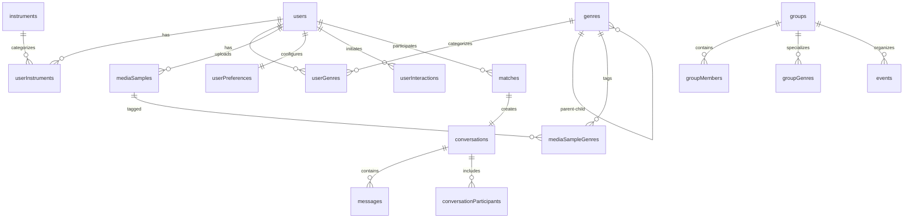

# Bandsy Database Schema Documentation

## Table of Contents

- [Overview](#overview)
- [Architecture](#architecture)
- [Entity Relationship Diagram](#entity-relationship-diagram)
- [Core Tables](#core-tables)
- [Lookup Tables](#lookup-tables)
- [Junction Tables](#junction-tables)
- [Matching & Discovery Tables](#matching--discovery-tables)
- [Communication Tables](#communication-tables)
- [Future Features Tables](#future-features-tables)
- [Indexes](#indexes)
- [Business Rules](#business-rules)
- [Data Types & Constraints](#data-types--constraints)
- [Security Considerations](#security-considerations)
- [Performance Considerations](#performance-considerations)

## Overview

The Bandsy database schema is designed to support a music collaboration platform that connects musicians based on their instruments, genres, location, and skill levels. The schema follows PostgreSQL conventions and uses Drizzle ORM for type-safe database operations.

### Key Features Supported

- User profiles with instruments and genre preferences
- Audio/video sample uploads and management
- Geographic-based matching with distance calculations
- Skill-based compatibility scoring
- Real-time messaging and conversations
- Group/band formation and management
- Premium subscription features
- Event management for performances

### Technology Stack

- **Database**: PostgreSQL with PostGIS for geospatial queries
- **ORM**: Drizzle ORM with TypeScript
- **Authentication**: Clerk integration
- **File Storage**: UploadThing for media samples

## Architecture

### Database Design Principles

1. **Normalization**: Third Normal Form (3NF) with selective denormalization for performance
2. **Scalability**: Designed for horizontal scaling with proper indexing
3. **Data Integrity**: Strong referential integrity with cascading deletes
4. **Performance**: Optimized for read-heavy workloads with computed fields
5. **Extensibility**: Flexible JSON fields for metadata and future features

### Schema Naming Convention

- Tables: `bandsy_{table_name}` (using pgTableCreator)
- Columns: camelCase for JavaScript compatibility
- Indexes: `{table}_{column}_idx` or `{table}_{purpose}_idx`
- Foreign Keys: `{referenced_table}Id`

## Entity Relationship Diagram



## Core Tables

### users

**Purpose**: Central user profile and authentication data

| Column          | Type                     | Constraints             | Description                      |
| --------------- | ------------------------ | ----------------------- | -------------------------------- |
| id              | UUID                     | PRIMARY KEY             | Internal user identifier         |
| clerkId         | VARCHAR(255)             | NOT NULL, UNIQUE        | Clerk authentication ID          |
| username        | VARCHAR(50)              | NOT NULL, UNIQUE        | Unique username for profile URLs |
| displayName     | VARCHAR(100)             | NOT NULL                | Public display name              |
| bio             | TEXT                     | -                       | User biography/description       |
| age             | INTEGER                  | -                       | User age (optional)              |
| showAge         | BOOLEAN                  | DEFAULT false           | Privacy setting for age display  |
| city            | VARCHAR(100)             | -                       | User's city                      |
| region          | VARCHAR(100)             | -                       | User's state/province            |
| country         | VARCHAR(100)             | -                       | User's country                   |
| latitude        | NUMERIC(10,8)            | -                       | Precise location for matching    |
| longitude       | NUMERIC(11,8)            | -                       | Precise location for matching    |
| profileImageUrl | VARCHAR(500)             | -                       | Profile image URL                |
| isActive        | BOOLEAN                  | DEFAULT true            | Account status                   |
| lastActiveAt    | TIMESTAMP WITH TIME ZONE | -                       | Last activity timestamp          |
| createdAt       | TIMESTAMP WITH TIME ZONE | NOT NULL, DEFAULT NOW() | Account creation                 |
| updatedAt       | TIMESTAMP WITH TIME ZONE | AUTO-UPDATE             | Last profile update              |
| deletedAt       | TIMESTAMP WITH TIME ZONE | -                       | Soft delete timestamp            |

**Business Rules**:

- Username must be URL-safe and unique across platform
- Location data is used for geographic matching algorithms
- Soft delete preserves data integrity for historical records
- ClerkId integration ensures secure authentication

**Indexes**:

- `users_clerk_id_idx`: Fast authentication lookups
- `users_location_idx`: Geographic queries (lat, lng)
- `users_active_idx`: Filter active users

### mediaSamples

**Purpose**: Audio/video samples uploaded by users to showcase their skills

| Column       | Type                     | Constraints             | Description                           |
| ------------ | ------------------------ | ----------------------- | ------------------------------------- |
| id           | UUID                     | PRIMARY KEY             | Sample identifier                     |
| userId       | UUID                     | NOT NULL, FK → users.id | Sample owner                          |
| instrumentId | UUID                     | FK → instruments.id     | Primary instrument featured           |
| title        | VARCHAR(200)             | NOT NULL                | Sample title                          |
| description  | TEXT                     | -                       | Sample description                    |
| fileUrl      | VARCHAR(500)             | NOT NULL                | UploadThing file URL                  |
| fileType     | VARCHAR(50)              | NOT NULL                | "audio" or "video"                    |
| duration     | INTEGER                  | -                       | Duration in seconds                   |
| metadata     | JSON                     | -                       | File metadata (bitrate, format, etc.) |
| isPublic     | BOOLEAN                  | DEFAULT true            | Visibility setting                    |
| createdAt    | TIMESTAMP WITH TIME ZONE | NOT NULL, DEFAULT NOW() | Upload timestamp                      |

**Business Rules**:

- File URLs are managed by UploadThing CDN
- Duration is extracted from audio/video files automatically
- Private samples are only visible to the owner
- Metadata stores technical file information for future filtering

**Indexes**:

- `media_samples_user_idx`: User's sample collections
- `media_samples_instrument_idx`: Browse by instrument

## Lookup Tables

### instruments

**Purpose**: Master list of musical instruments with categorization

| Column    | Type                     | Constraints             | Description                                        |
| --------- | ------------------------ | ----------------------- | -------------------------------------------------- |
| id        | UUID                     | PRIMARY KEY             | Instrument identifier                              |
| name      | VARCHAR(100)             | NOT NULL, UNIQUE        | Instrument name                                    |
| category  | VARCHAR(50)              | -                       | Instrument family (string, percussion, wind, etc.) |
| createdAt | TIMESTAMP WITH TIME ZONE | NOT NULL, DEFAULT NOW() | Creation timestamp                                 |

**Business Rules**:

- Instrument names must be unique to prevent duplicates
- Categories enable instrument family matching (e.g., all string instruments)
- Seeded with common instruments, expandable by admins

### genres

**Purpose**: Hierarchical music genre classification system

| Column        | Type                     | Constraints             | Description                |
| ------------- | ------------------------ | ----------------------- | -------------------------- |
| id            | UUID                     | PRIMARY KEY             | Genre identifier           |
| name          | VARCHAR(100)             | NOT NULL, UNIQUE        | Genre name                 |
| parentGenreId | UUID                     | FK → genres.id          | Parent genre for hierarchy |
| createdAt     | TIMESTAMP WITH TIME ZONE | NOT NULL, DEFAULT NOW() | Creation timestamp         |

**Business Rules**:

- Self-referencing hierarchy (Rock → Alternative Rock → Indie Rock)
- Parent genres provide broader matching capabilities
- Maximum depth of 3 levels recommended for UX
- Users can select both parent and child genres

## Junction Tables

### userInstruments

**Purpose**: Many-to-many relationship between users and instruments with skill levels

| Column            | Type                     | Constraints                   | Description                                    |
| ----------------- | ------------------------ | ----------------------------- | ---------------------------------------------- |
| id                | UUID                     | PRIMARY KEY                   | Relationship identifier                        |
| userId            | UUID                     | NOT NULL, FK → users.id       | User reference                                 |
| instrumentId      | UUID                     | NOT NULL, FK → instruments.id | Instrument reference                           |
| skillLevel        | ENUM                     | NOT NULL                      | beginner, intermediate, advanced, professional |
| yearsOfExperience | INTEGER                  | -                             | Years playing this instrument                  |
| isPrimary         | BOOLEAN                  | DEFAULT false                 | Primary instrument flag                        |
| createdAt         | TIMESTAMP WITH TIME ZONE | NOT NULL, DEFAULT NOW()       | Association timestamp                          |

**Business Rules**:

- Users can have multiple instruments with different skill levels
- Only one instrument can be marked as primary per user
- Skill levels enable compatibility matching
- Years of experience provides additional matching weight

### userGenres

**Purpose**: Many-to-many relationship between users and genres with preferences

| Column     | Type                     | Constraints              | Description             |
| ---------- | ------------------------ | ------------------------ | ----------------------- |
| id         | UUID                     | PRIMARY KEY              | Relationship identifier |
| userId     | UUID                     | NOT NULL, FK → users.id  | User reference          |
| genreId    | UUID                     | NOT NULL, FK → genres.id | Genre reference         |
| preference | INTEGER                  | DEFAULT 1                | Preference scale 1-5    |
| createdAt  | TIMESTAMP WITH TIME ZONE | NOT NULL, DEFAULT NOW()  | Association timestamp   |

**Business Rules**:

- Preference scoring enables weighted genre matching
- Users can like multiple genres with varying intensities
- Algorithm uses preference weights for compatibility scoring

### mediaSampleGenres

**Purpose**: Tags genres to media samples for categorization

| Column        | Type | Constraints          | Description             |
| ------------- | ---- | -------------------- | ----------------------- |
| id            | UUID | PRIMARY KEY          | Relationship identifier |
| mediaSampleId | UUID | FK → mediaSamples.id | Sample reference        |
| genreId       | UUID | FK → genres.id       | Genre reference         |

**Business Rules**:

- Samples can have multiple genre tags
- Enables genre-based sample discovery
- Users can filter samples by genre preferences

## Matching & Discovery Tables

### userMatchProfiles

**Purpose**: Pre-computed matching data for performance optimization

| Column            | Type                     | Constraints             | Description                             |
| ----------------- | ------------------------ | ----------------------- | --------------------------------------- |
| id                | UUID                     | PRIMARY KEY             | Profile identifier                      |
| userId            | UUID                     | NOT NULL, FK → users.id | User reference                          |
| locationLat       | NUMERIC(10,8)            | -                       | Cached latitude                         |
| locationLng       | NUMERIC(11,8)            | -                       | Cached longitude                        |
| city              | VARCHAR(100)             | -                       | Cached city                             |
| region            | VARCHAR(100)             | -                       | Cached region                           |
| country           | VARCHAR(100)             | -                       | Cached country                          |
| searchRadius      | INTEGER                  | DEFAULT 50              | Search radius in km                     |
| ageRangeMin       | INTEGER                  | -                       | Minimum age preference                  |
| ageRangeMax       | INTEGER                  | -                       | Maximum age preference                  |
| lookingFor        | VARCHAR(50)              | DEFAULT 'any'           | Seeking type (collaborator, band, etc.) |
| skillLevelAverage | NUMERIC(3,2)             | -                       | Computed average skill level            |
| activityScore     | INTEGER                  | DEFAULT 0               | Engagement activity score               |
| isActive          | BOOLEAN                  | DEFAULT true            | Matching availability                   |
| lastActive        | TIMESTAMP WITH TIME ZONE | DEFAULT NOW()           | Last matching activity                  |
| createdAt         | TIMESTAMP WITH TIME ZONE | NOT NULL, DEFAULT NOW() | Profile creation                        |
| updatedAt         | TIMESTAMP WITH TIME ZONE | NOT NULL, DEFAULT NOW() | Last update                             |

**Business Rules**:

- Denormalized for fast geographic queries
- Activity score influences match ranking
- Automatically updated when user profile changes
- Geographic indexes enable efficient distance calculations

### userInteractions

**Purpose**: Track user swipes, likes, and blocks for algorithm improvement

| Column     | Type                     | Constraints             | Description                       |
| ---------- | ------------------------ | ----------------------- | --------------------------------- |
| id         | UUID                     | PRIMARY KEY             | Interaction identifier            |
| fromUserId | UUID                     | NOT NULL, FK → users.id | User performing action            |
| toUserId   | UUID                     | NOT NULL, FK → users.id | Target user                       |
| type       | ENUM                     | NOT NULL                | like, pass, super_like, block     |
| context    | ENUM                     | NOT NULL                | discovery, search, recommendation |
| createdAt  | TIMESTAMP WITH TIME ZONE | NOT NULL, DEFAULT NOW() | Interaction timestamp             |

**Business Rules**:

- Prevents showing same profiles repeatedly
- Enables machine learning algorithm training
- Context tracking improves recommendation accuracy
- Unique constraint prevents duplicate interactions

### matches

**Purpose**: Store confirmed matches when both users express mutual interest

| Column       | Type                     | Constraints             | Description                    |
| ------------ | ------------------------ | ----------------------- | ------------------------------ |
| id           | UUID                     | PRIMARY KEY             | Match identifier               |
| user1Id      | UUID                     | NOT NULL, FK → users.id | First user (always lower UUID) |
| user2Id      | UUID                     | NOT NULL, FK → users.id | Second user                    |
| matchScore   | NUMERIC(5,2)             | -                       | Computed compatibility score   |
| matchFactors | JSON                     | -                       | Detailed scoring breakdown     |
| status       | VARCHAR(20)              | DEFAULT 'active'        | active, unmatched, blocked     |
| createdAt    | TIMESTAMP WITH TIME ZONE | NOT NULL, DEFAULT NOW() | Match timestamp                |
| updatedAt    | TIMESTAMP WITH TIME ZONE | DEFAULT NOW()           | Status update timestamp        |

**Business Rules**:

- User1Id always contains the lexicographically smaller UUID for consistency
- Match score enables sorting by compatibility
- Match factors JSON stores detailed algorithm results
- Status enables soft unmatch without data loss

## Communication Tables

### conversations

**Purpose**: Chat sessions between matched users or group members

| Column      | Type                     | Constraints             | Description                        |
| ----------- | ------------------------ | ----------------------- | ---------------------------------- |
| id          | UUID                     | PRIMARY KEY             | Conversation identifier            |
| matchId     | UUID                     | FK → matches.id         | Associated match (for 1:1 chats)   |
| groupId     | UUID                     | FK → groups.id          | Associated group (for group chats) |
| isGroupChat | BOOLEAN                  | DEFAULT false           | Conversation type flag             |
| createdAt   | TIMESTAMP WITH TIME ZONE | NOT NULL, DEFAULT NOW() | Creation timestamp                 |
| updatedAt   | TIMESTAMP WITH TIME ZONE | AUTO-UPDATE             | Last message timestamp             |

**Business Rules**:

- Either matchId OR groupId must be set, not both
- Conversations auto-created when matches occur
- Group conversations support multiple participants
- UpdatedAt tracks last activity for sorting

### conversationParticipants

**Purpose**: Track who can participate in each conversation

| Column         | Type                     | Constraints                     | Description            |
| -------------- | ------------------------ | ------------------------------- | ---------------------- |
| id             | UUID                     | PRIMARY KEY                     | Participant identifier |
| conversationId | UUID                     | NOT NULL, FK → conversations.id | Conversation reference |
| userId         | UUID                     | NOT NULL, FK → users.id         | Participant user       |
| joinedAt       | TIMESTAMP WITH TIME ZONE | NOT NULL, DEFAULT NOW()         | Join timestamp         |

**Business Rules**:

- Required for all conversation types for consistent access control
- Enables group conversation management
- JoinedAt enables chronological participant tracking

### messages

**Purpose**: Individual messages within conversations

| Column         | Type                     | Constraints                     | Description                      |
| -------------- | ------------------------ | ------------------------------- | -------------------------------- |
| id             | UUID                     | PRIMARY KEY                     | Message identifier               |
| conversationId | UUID                     | NOT NULL, FK → conversations.id | Parent conversation              |
| senderId       | UUID                     | NOT NULL, FK → users.id         | Message author                   |
| type           | ENUM                     | NOT NULL                        | text, audio, image               |
| content        | TEXT                     | -                               | Message text content             |
| fileUrl        | VARCHAR(500)             | -                               | Media file URL (for audio/image) |
| metadata       | JSON                     | -                               | Message metadata                 |
| isRead         | BOOLEAN                  | DEFAULT false                   | Read status                      |
| createdAt      | TIMESTAMP WITH TIME ZONE | NOT NULL, DEFAULT NOW()         | Send timestamp                   |

**Business Rules**:

- Text messages require content, media messages require fileUrl
- Metadata stores additional info (file size, duration, etc.)
- Read status enables unread message counts
- CreatedAt provides message ordering

## Future Features Tables

### groups

**Purpose**: Band/group formation and management

| Column      | Type                     | Constraints             | Description         |
| ----------- | ------------------------ | ----------------------- | ------------------- |
| id          | UUID                     | PRIMARY KEY             | Group identifier    |
| name        | VARCHAR(200)             | NOT NULL                | Group/band name     |
| description | TEXT                     | -                       | Group description   |
| imageUrl    | VARCHAR(500)             | -                       | Group profile image |
| isActive    | BOOLEAN                  | DEFAULT true            | Group status        |
| maxMembers  | INTEGER                  | DEFAULT 10              | Member limit        |
| createdAt   | TIMESTAMP WITH TIME ZONE | NOT NULL, DEFAULT NOW() | Creation timestamp  |
| updatedAt   | TIMESTAMP WITH TIME ZONE | AUTO-UPDATE             | Last update         |

### groupMembers

**Purpose**: Track group membership and roles

| Column       | Type                     | Constraints                | Description                 |
| ------------ | ------------------------ | -------------------------- | --------------------------- |
| id           | UUID                     | PRIMARY KEY                | Membership identifier       |
| groupId      | UUID                     | NOT NULL, FK → groups.id   | Group reference             |
| userId       | UUID                     | NOT NULL, FK → users.id    | Member reference            |
| role         | ENUM                     | NOT NULL, DEFAULT 'member' | admin, member               |
| instrumentId | UUID                     | FK → instruments.id        | Primary instrument in group |
| joinedAt     | TIMESTAMP WITH TIME ZONE | NOT NULL, DEFAULT NOW()    | Join timestamp              |

### subscriptions

**Purpose**: Premium feature subscription management

| Column    | Type                     | Constraints             | Description                |
| --------- | ------------------------ | ----------------------- | -------------------------- |
| id        | UUID                     | PRIMARY KEY             | Subscription identifier    |
| userId    | UUID                     | NOT NULL, FK → users.id | Subscriber                 |
| planType  | VARCHAR(50)              | NOT NULL                | basic, premium, pro        |
| status    | VARCHAR(20)              | NOT NULL                | active, cancelled, expired |
| startDate | TIMESTAMP WITH TIME ZONE | NOT NULL                | Subscription start         |
| endDate   | TIMESTAMP WITH TIME ZONE | -                       | Subscription end           |
| createdAt | TIMESTAMP WITH TIME ZONE | NOT NULL, DEFAULT NOW() | Creation timestamp         |

### events

**Purpose**: Performance events and gig management

| Column       | Type                     | Constraints              | Description        |
| ------------ | ------------------------ | ------------------------ | ------------------ |
| id           | UUID                     | PRIMARY KEY              | Event identifier   |
| groupId      | UUID                     | NOT NULL, FK → groups.id | Organizing group   |
| title        | VARCHAR(200)             | NOT NULL                 | Event title        |
| description  | TEXT                     | -                        | Event description  |
| venue        | VARCHAR(200)             | -                        | Venue name         |
| address      | TEXT                     | -                        | Event address      |
| startDate    | TIMESTAMP WITH TIME ZONE | NOT NULL                 | Event start time   |
| endDate      | TIMESTAMP WITH TIME ZONE | -                        | Event end time     |
| isPublic     | BOOLEAN                  | DEFAULT true             | Event visibility   |
| maxAttendees | INTEGER                  | -                        | Attendance limit   |
| createdAt    | TIMESTAMP WITH TIME ZONE | NOT NULL, DEFAULT NOW()  | Creation timestamp |

## Indexes

### Performance-Critical Indexes

| Table             | Index Name                      | Columns                    | Purpose                        |
| ----------------- | ------------------------------- | -------------------------- | ------------------------------ |
| users             | users_clerk_id_idx              | clerkId                    | Authentication lookups         |
| users             | users_location_idx              | latitude, longitude        | Geographic queries             |
| users             | users_active_idx                | isActive                   | Filter active users            |
| userMatchProfiles | user_match_profile_location_idx | locationLat, locationLng   | Geographic matching            |
| userMatchProfiles | user_match_profile_active_idx   | isActive, lastActive       | Active user filtering          |
| userInteractions  | user_interaction_from_user_idx  | fromUserId                 | User interaction history       |
| userInteractions  | unique_user_interaction         | fromUserId, toUserId, type | Prevent duplicate interactions |
| matches           | match_user1_idx                 | user1Id                    | User's matches                 |
| matches           | match_user2_idx                 | user2Id                    | User's matches                 |
| matches           | unique_match                    | user1Id, user2Id           | Prevent duplicate matches      |
| messages          | messages_conversation_idx       | conversationId             | Conversation message loading   |
| messages          | messages_created_at_idx         | createdAt                  | Message chronological ordering |

### Composite Indexes for Complex Queries

```sql
-- Geographic matching with filters
CREATE INDEX user_match_profiles_geo_active_idx
ON bandsy_user_match_profile (isActive, locationLat, locationLng, lastActive);

-- Message pagination by conversation
CREATE INDEX messages_conversation_time_idx
ON bandsy_message (conversationId, createdAt DESC);

-- User instrument filtering
CREATE INDEX user_instruments_instrument_skill_idx
ON bandsy_user_instrument (instrumentId, skillLevel);
```

## Business Rules

### Data Integrity Rules

1. **User Profile Completeness**:
   - Users must have at least one instrument and genre
   - Location is required for matching features
   - Username must be unique and URL-safe

2. **Matching Logic**:
   - Users cannot match with themselves
   - Blocked users cannot appear in discovery
   - Matches require mutual likes (both users must like each other)
   - Geographic distance respects user preferences

3. **Sample Management**:
   - Private samples are only visible to owner
   - Sample duration is auto-extracted from files
   - File cleanup occurs when samples are deleted

4. **Group Dynamics**:
   - Groups must have at least one admin
   - Admin role cannot be deleted if only admin
   - Group members can have different instruments within group

5. **Communication Rules**:
   - Only matched users or group members can message
   - Messages are ordered chronologically
   - Read status is per-user in group conversations

### Soft Delete Strategy

- Users: `deletedAt` timestamp preserves historical data
- Hard deletes: Media files cleaned up via UploadThing webhooks
- Cascading deletes: User deletion removes all related data

## Data Types & Constraints

### Geographic Data

- **Latitude**: NUMERIC(10,8) - Supports precision to ~1.1mm
- **Longitude**: NUMERIC(11,8) - Supports precision to ~1.1mm
- **Distance**: Calculated using Haversine formula in application layer

### Temporal Data

- All timestamps use `TIMESTAMP WITH TIME ZONE` for global users
- CreatedAt fields default to `CURRENT_TIMESTAMP`
- UpdatedAt fields use Drizzle's `$onUpdate` trigger

### File Storage

- File URLs are VARCHAR(500) to accommodate CDN URLs
- File metadata stored as JSON for flexibility
- File types validated at application layer

### Enumerated Values

- Defined as PostgreSQL ENUMs for data consistency
- Skill levels: beginner → intermediate → advanced → professional
- Interaction types: like, pass, super_like, block
- Message types: text, audio, image

## Security Considerations

### Authentication & Authorization

- Clerk integration provides secure authentication
- All user operations validate ownership
- Admin operations require elevated permissions

### Data Privacy

- Geographic coordinates stored with limited precision
- Age display is optional (showAge flag)
- Private samples not exposed in public APIs

### Input Validation

- All text inputs sanitized at application layer
- File uploads validated for type and size
- SQL injection prevented by parameterized queries

### Audit Trail

- CreatedAt/UpdatedAt timestamps on all major entities
- User interactions logged for algorithm improvement
- Soft deletes preserve historical data

## Performance Considerations

### Read Optimization

- Denormalized match profiles for fast geographic queries
- Computed skill level averages cached
- JSON metadata fields for flexible queries without schema changes

### Write Optimization

- Bulk insert capabilities for seeding data
- Minimal foreign key constraints on high-write tables
- Asynchronous processing for heavy operations

### Caching Strategy

- User match profiles cached in Redis
- Geographic queries use PostGIS indexes
- Conversation lists cached with message counts

### Scaling Considerations

- Tables designed for horizontal partitioning by user ID
- Geographic queries can leverage spatial indexing
- Match scoring can be offloaded to separate service

### Query Patterns

- Most queries filter by userId first
- Geographic queries use bounding box then distance
- Pagination uses cursor-based approach for consistency

---

_Last Updated: December 2024_
_Schema Version: 1.0_
_Generated from: src/server/db/schema.ts_
